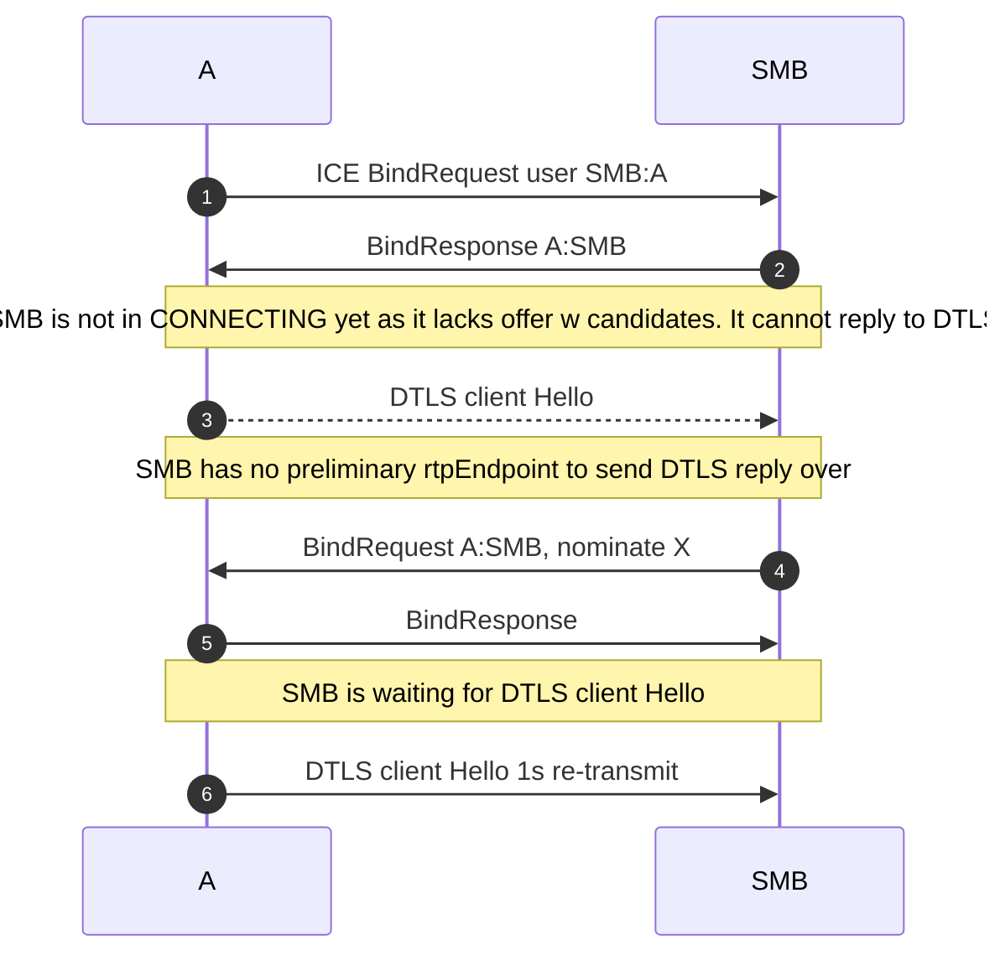

```mermaid
sequenceDiagram
autonumber

participant A
participant SMB


A->>SMB: ICE BindRequest user SMB:A
SMB->>A: BindResponse A:SMB
note over A,SMB: SMB is not in CONNECTING yet as it lacks offer w candidates. It cannot reply to DTLS
A-->>SMB: DTLS client Hello
note over A,SMB: SMB has no preliminary rtpEndpoint to send DTLS reply over
SMB->>A: BindRequest A:SMB, nominate X
A->>SMB: BindResponse
note over A,SMB: SMB is waiting for DTLS client Hello
A->>SMB: DTLS client Hello 1s re-transmit
```
