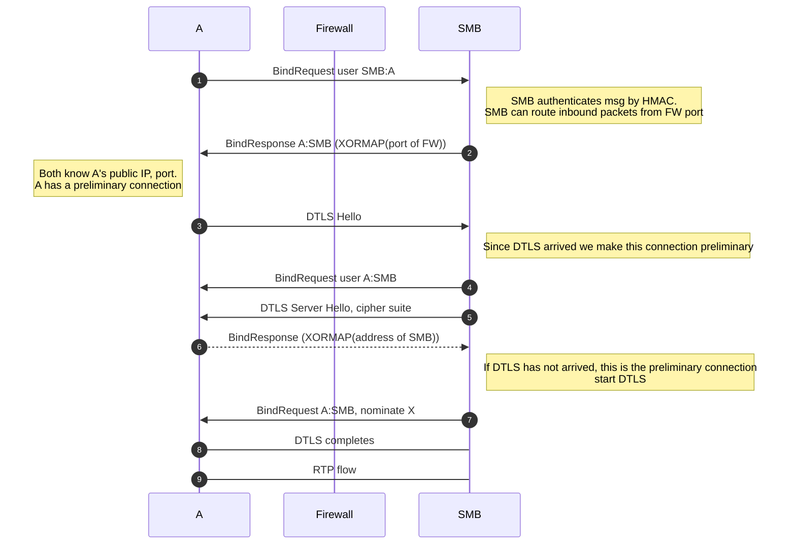

```mermaid
sequenceDiagram
autonumber

participant A
participant Firewall
participant SMB


A->>SMB: BindRequest user SMB:A
note right of SMB: SMB authenticates msg by HMAC.<br> SMB can route inbound packets from FW port
SMB->>A: BindResponse A:SMB (XORMAP(port of FW))
note left of A: Both know A's public IP, port.<br>A has a preliminary connection
A->>SMB: DTLS Hello
note right of SMB: Since DTLS arrived we make this connection preliminary
SMB->>A: BindRequest user A:SMB
SMB->>A: DTLS Server Hello, cipher suite
A-->>SMB: BindResponse (XORMAP(address of SMB))
note right of SMB: If DTLS has not arrived, this is the preliminary connection<br>start DTLS
SMB->>A: BindRequest A:SMB, nominate X
A->SMB: DTLS completes
A->SMB: RTP flow

```
