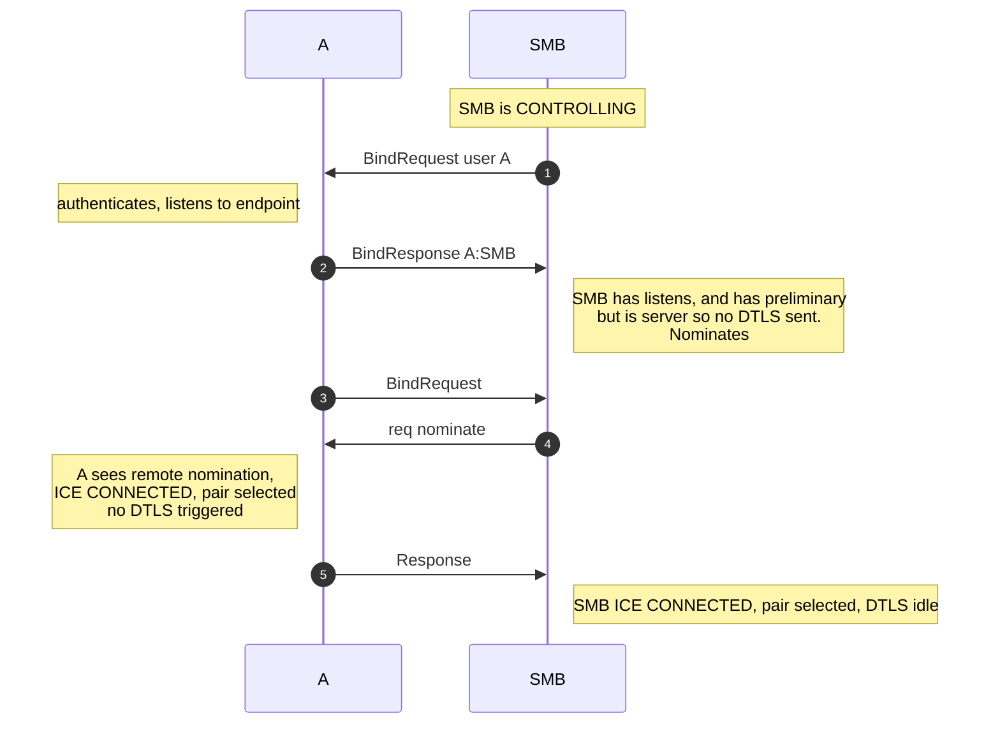

```mermaid
sequenceDiagram
autonumber

participant A
participant SMB

Note over SMB: SMB is CONTROLLING
SMB->>A: BindRequest user A
note left of A: authenticates, listens to endpoint
A->>SMB: BindResponse A:SMB
note right of SMB: SMB has listens, and has preliminary<br> but is server so no DTLS sent.<br> Nominates
A->>SMB: BindRequest
SMB->>A: req nominate
note left of A: A sees remote nomination, <br>ICE CONNECTED, pair selected<br>no DTLS triggered
A->>SMB: Response
note right of SMB: SMB ICE CONNECTED, pair selected, DTLS idle
```
