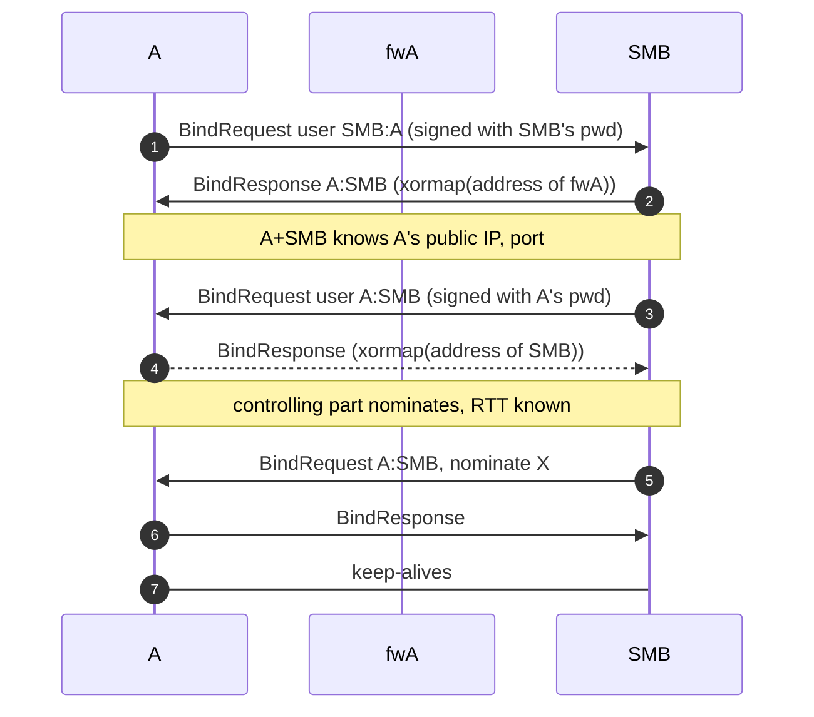

```mermaid
sequenceDiagram
autonumber

participant A
participant fwA
participant SMB


A->>SMB: BindRequest user SMB:A (signed with SMB's pwd)
SMB->>A: BindResponse A:SMB (xormap(address of fwA))
note over A,SMB: A+SMB knows A's public IP, port
SMB->>A: BindRequest user A:SMB (signed with A's pwd)
A-->>SMB: BindResponse (xormap(address of SMB))
note over A,SMB: controlling part nominates, RTT known
SMB->>A: BindRequest A:SMB, nominate X
A->>SMB: BindResponse
A->SMB: keep-alives
```