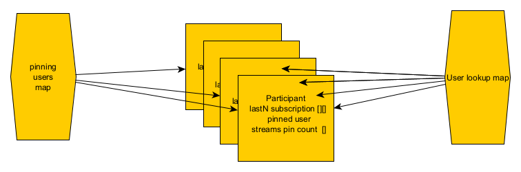

# Use of PLI in SMB
Picture Loss Indicator is a request sent over RTCP to request the remote side to generate a new key frame. It is generally needed of the 
receiver lost the initial key frame or has encountered too much packet loss to make it meaningful trying to mend the stream by re-transmissions.

## Situations when a PLI is needed and sent from SMB
- A client sends a PLI to SMB for a specific video ssrc. SMB cannot regenerate the key frame and must forward this PLI to the original sender of the stream.
- A client joins a video meeting. All existing clients with video must now generate key frames for all the streams that the new client will receive.
- SMB Director changes the stream quality sent to a client due to bandwidth variation. The stream carrying the quality needed, must generate a key frame.
- A client pins another user. This is similar to quality changing of stream being forwarded. The pinned user must generate a key frame on the higher quality stream. The previously pinned user msut generate key frame for his lower resolution streams.
- A client enters the lastN list. His stream is new to everyone else and a key frame must be generated.
- A client stops sending on a stream that was previsouly active. SMB has to assume client dropped stream because of uplink bandwidth and other streams from that user must now send key frame.
- A client starts sending on a stream that was previously idle.
- A client transport has connected. All other video streams are requested to send new key frame.

The situation with pin is happening frequently as dominant speaker is pinned by all users. Instead of sending massive number of PLI, the outbound ssc context remembers that a PLI has been sent and whether a n key frame has been received after that. It means multiple PLIs may be batched as one. Unfortunately, when a key frame has arrived, we are not sure if stragglers pinning the user, got that key frame or not and we need to request another one. We are using RTT to figure out if the pinning client will likely see the key frame that was recently received and, in those cases, we drop the PLI.


### questions marks
In updateDirectorUplinkEstimates it seems that all users that are pinning someone, and also had a new "client downlink estimate" will trigger a PLI request to pinned target. IF it is the same user, only one PLI will be sent.
This seems like a lot of load.


# Pinning
Each user can pin one other user. Each user can be pinned by >= 0 users. Decisions are made at the following events:
1. A user leaves. Data structure must be updated to clear all pins on A
2. A packet from A on stream S arrives. Is this packet wanted by anyone who pins user A?
3. A packet from A on stream S is ready. Should this packet be forwarded to user Y?

Conceptually the pin feature is a table as below with one digit per row, and 0 or more digits per column. Users on the vertical axis pin users on the horizontal axis.
```
       A  B  C  D

A      0  1  0  0
B      0  0  1  0
C      1  0  0  0
D      1  0  0  0
E      0  0  0  0
```
By storing who is pinned along the vertical axis. It is easy to make decision 3.
```
       A  B  C  D

A (B)  0  1  0  0
B (C)  0  0  1  0
C (A)  1  0  0  0
D (A)  1  0  0  0
E ()   0  0  0  0
```

By storing a pin count per stream for each user, it is easy to make decision 2. It is easy to update as well when pin changes, or quality subscription changes.
The actual quality subscribed to for the pinned user can be derived from the subscription quality on dominant speaker as described in this document.
```
       A  B  C  D
count  2  1  1  0

A (B)  0  1  0  0
B (C)  0  0  1  0
C (A)  1  0  0  0
D (A)  1  0  0  0
E ()   0  0  0  0
```

The data above is cheap to maintain when users pin, unpin as the lookup is trivial.

To answer question 1, you still need a list of all users pinning a specific person. All those have to be updated with regards to their pin target.
This list can either be a list of user ids, or a bit vector. The first option is good if the number of pinning users is expected to be small.
The second option is good if the number of pinning users is expected to be big. In the latter case it is also a good option to store a list of exceptions. 
That is, who is not pinning a specific person.
The bit vector poses a problem when users are added and leaves as the position in the vector is tied to a specific user. To reduce shifting data in the vector
a content table is preferable to allow users to keep their position in the vector also when others are removed.
However, making decision 1, is not a frequent event. A check first if the pin count is > 0 on the leaving user, followed by a scan through the, hopefully short, list of
pinning users on the vertical axis is sufficient to make the necessary update.


Storage with bit vector is compact.
```
For x pinning users

x * id(size_t)
x * (x / 32) * sizeof(int32_t) (if all pin like no one else)
x * 3 * sizeof(int16_t) for pinned by stream count

For 1024 pinning users it makes 145408 B roughly
```

Storing only a map of pinning users, a count of pinned streams per user, and a pinned user per user would require:
```
x * id(size_t)
x * 3 * sizeof(uint16_t)
x * (id + set OH)

~ 22528 B for 1024 users

```
This is clearly the most efficient in terms of storage and maintenance. Two maps, one containing participant records are sufficient. Each participant record contains: 
- optional pinned user id
- pinnedby count per stream quality

The map contining the records allows for quick lookup of the particpant's data both for receiving a packet and forwarding a packet.
The map containing pointers to participant records for users who are actually pinning someone, will allow quick scan of pinning users when a pinned user leaves. You could scan the first map but it will be larger.



# Stream subscription on lastN list
Each user has a limited downlink bandwidth and this will inevitable put a restriciton on which streams the user may receive from the video senders in the lastN list.
The subscription can be expressed as a quality matrix like 
```
Wanted quality, position and quality
    H  M  L
1:  1  0  0
2:  0  1  0
3:  0  1  0 
4:  0  1  0
5:  0  1  0

```

For all users in the system the total subscription and be aggregated as matrix addition into:
```
    H   M   L
1: 25   4   1
2:  0   29  1
3:  0   29  1 
4:  0   29  1
5:  0   29  1
```

The subsriptions could be like the pin matrix, for a specific user and quality. The advantage by having a subscription table referring to a position in the lastN list, means the subscription is mostly static, but the lastN list may change every 2s. Only when a user's downlink limit changes, would his subscription potentially change and the aggregated matrix must be update by a subtraction and addition.

I would actually suggest that the math::Matrix is used to store the subscription as it provides Matrix addition and subtraction.
## Maintaining the subscriptions
Events that will cause updating of the subscription matrices:
A user joins or leaves. A user's downlink estimate is updated in a way that requires his subscription to change.

- If a user joins a new default subscription for initial downlink estimate will be created. That matrix is then added to the global one.
- If a user leaves, his matrix must be subtracted from the global matrix.
- If a user changes his subscription, his current matrix must be subtraced from the global matrix and the new one added to the global matrix.

These events can be considered to be fairly infrequent. The client downlink estimate may cross a threshold often but decision to actually change the subscription to increase bitrate should be limited in frequency.

# Combining subscriptions and pin to receive and forward packets
## Receiving a packet
When a packet is received from user A stream S, the following will happen:
```
Find user A's participant record.
Find A's position in the lastN list. 
If A has a position: 
    check the global subscription matrix to see if his position has a count for the stream S. If so process the packet.
else :
    check participant A's pinned count for stream S. If it is > 0, process the packet.
```
## Forwarding a packet
When A packet from A stream S is about to be forwarded to X.
```
Retrieve A's and X's participant record.
Find A's position in lastN list.
If X is pinning A (it is in X's participant record)
       If S is of desired quality according to X subscription matrix for position 1 in lastN, then forward the packet.
else if A has a position in lastN
       check X's subscription matrix for A's position to see if stream S is wanted for this position.
```
## Complexity
Finding participant records A and X are plain hash map lookups.
Finding A's position in lastN is either a linear scan of a short list, or retrieved from a map in ActiveMediaList that would map users in lastN to their current position. Updating this map is a bit tedious as rearranging 
the lastN members requires updating all in the map.
The other values are straightforward referencing in the participant records.
