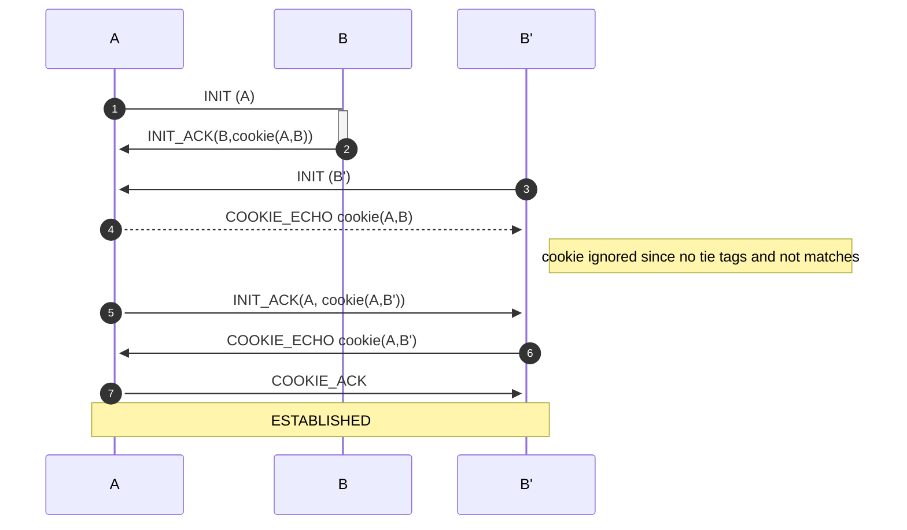

```mermaid
sequenceDiagram
autonumber

participant A
participant B
participant B'

A->B: INIT (A)
activate A
activate B
B->>A: INIT_ACK(B,cookie(A,B))
deactivate B
B'->>A: INIT (B')
activate B'
A-->>B': COOKIE_ECHO cookie(A,B)
note right of B': cookie ignored since no tie tags and not matches
A->>B': INIT_ACK(A, cookie(A,B'))
B'->>A: COOKIE_ECHO cookie(A,B')
A->>B': COOKIE_ACK
note over A,B': ESTABLISHED

```