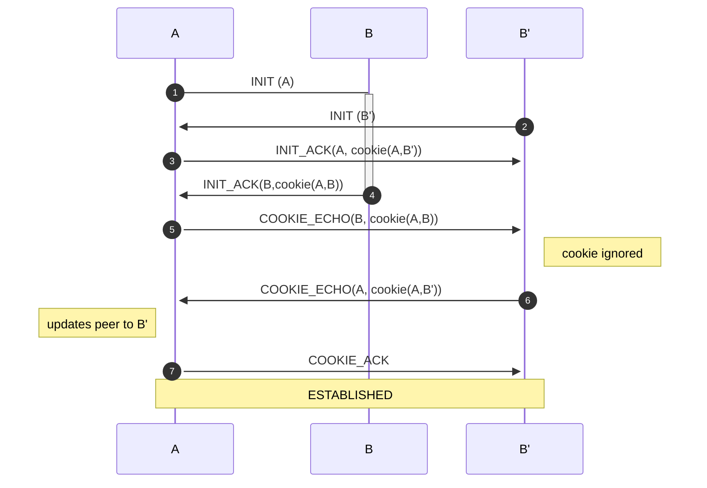

```mermaid
sequenceDiagram

autonumber
A->B: INIT (A)
activate A
activate B
B'->>A: INIT (B')
activate B'
A->>B': INIT_ACK(A, cookie(A,B'))
B->>A: INIT_ACK(B,cookie(A,B))
deactivate B
A->>B': COOKIE_ECHO(B, cookie(A,B))
note right of B': cookie ignored
B'->>A: COOKIE_ECHO(A, cookie(A,B'))

note left of A: updates peer to B'
A->>B': COOKIE_ACK
note over A,B': ESTABLISHED
```