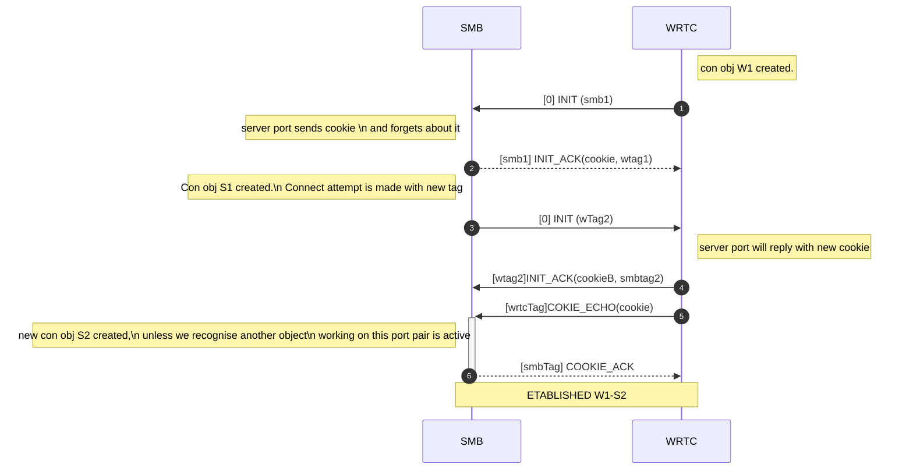

```mermaid
sequenceDiagram
autonumber

participant SMB
participant WRTC

note right of WRTC: con obj W1 created.
WRTC->>SMB: [0] INIT (smb1)
note left of SMB: server port sends cookie \n and forgets about it

SMB-->>WRTC: [smb1] INIT_ACK(cookie, wtag1)
note left of SMB: Con obj S1 created.\n Connect attempt is made with new tag
SMB->>WRTC: [0] INIT (wTag2)
note right of WRTC: server port will reply with new cookie
WRTC->>SMB: [wtag2]INIT_ACK(cookieB, smbtag2)
WRTC->>+SMB: [wrtcTag]COKIE_ECHO(cookie)
note left of SMB: new con obj S2 created,\n unless we recognise another object\n working on this port pair is active
SMB-->>-WRTC: [smbTag] COOKIE_ACK
note over SMB,WRTC: ETABLISHED W1-S2
```