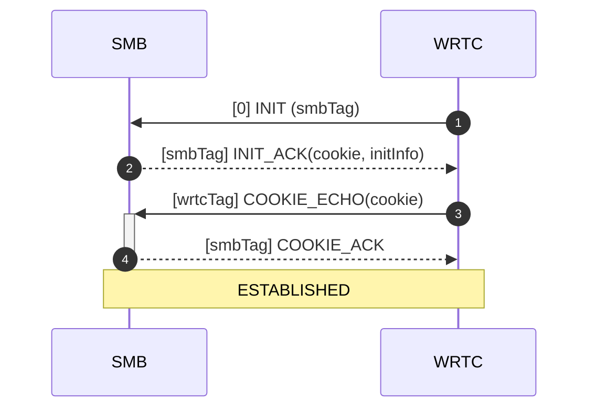

```mermaid
sequenceDiagram
autonumber

participant SMB
participant WRTC

WRTC->>SMB: [0] INIT (smbTag)
SMB-->>WRTC: [smbTag] INIT_ACK(cookie, initInfo)
WRTC->>+SMB: [wrtcTag] COOKIE_ECHO(cookie)
SMB-->>-WRTC: [smbTag] COOKIE_ACK
note over SMB,WRTC: ESTABLISHED
```