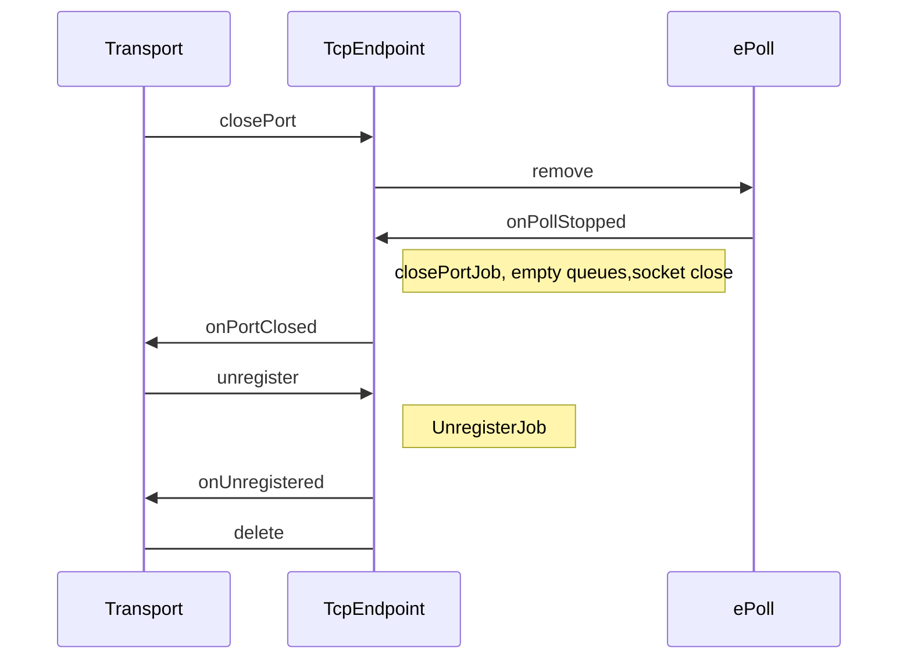

```mermaid
sequenceDiagram

participant Transport
participant TcpEndpoint
participant ePoll

Transport->>TcpEndpoint: closePort
TcpEndpoint->>ePoll: remove
ePoll->>TcpEndpoint: onPollStopped
note right of TcpEndpoint: closePortJob, empty queues,socket close
TcpEndpoint->>Transport: onPortClosed
Transport->>TcpEndpoint: unregister
note right of TcpEndpoint: UnregisterJob
TcpEndpoint->>Transport: onUnregistered
Transport->TcpEndpoint: delete

```