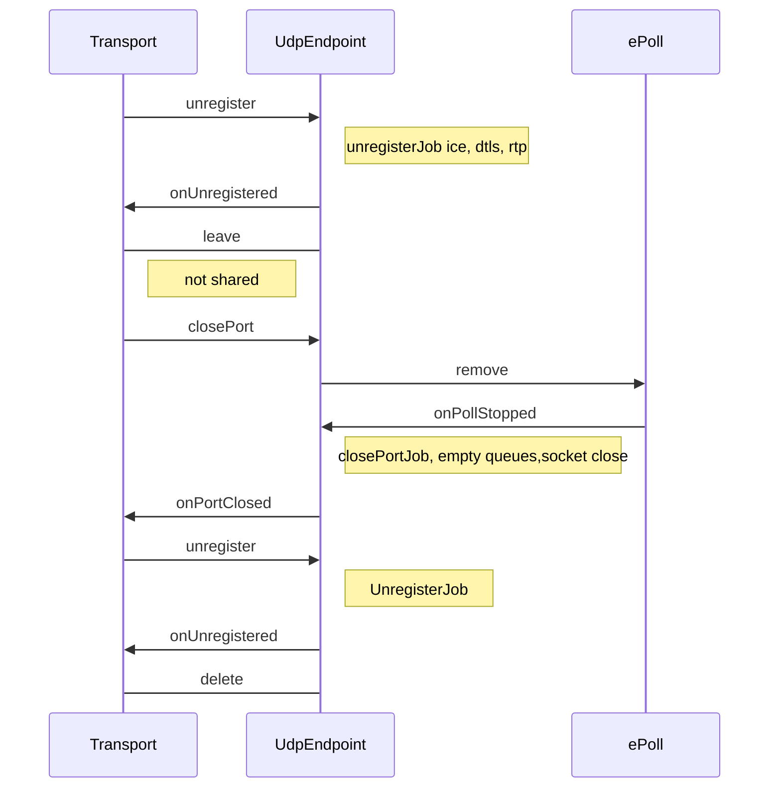

```mermaid
sequenceDiagram

participant Transport
participant UdpEndpoint
participant ePoll

Transport->>UdpEndpoint: unregister
note right of UdpEndpoint: unregisterJob ice, dtls, rtp
UdpEndpoint->>Transport: onUnregistered
Transport->UdpEndpoint: leave
note right of Transport: not shared
Transport->>UdpEndpoint: closePort
UdpEndpoint->>ePoll: remove
ePoll->>UdpEndpoint: onPollStopped
note right of UdpEndpoint: closePortJob, empty queues,socket close
UdpEndpoint->>Transport: onPortClosed
Transport->>UdpEndpoint: unregister
note right of UdpEndpoint: UnregisterJob
UdpEndpoint->>Transport: onUnregistered
Transport->UdpEndpoint: delete

```