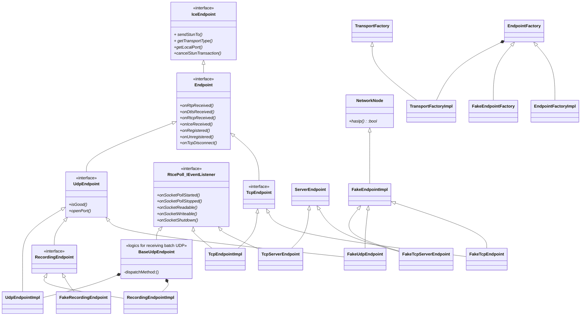

```mermaid

classDiagram
    IceEndpoint <|-- Endpoint
    Endpoint <|-- UdpEndpoint

    RtcePoll_IEventListener <|-- BaseUdpEndpoint
    BaseUdpEndpoint *-- UdpEndpointImpl
    UdpEndpoint <|-- UdpEndpointImpl

    Endpoint <|-- TcpEndpoint
    TcpEndpoint <|-- TcpEndpointImpl
    RtcePoll_IEventListener <|-- TcpEndpointImpl

    UdpEndpoint <|-- RecordingEndpoint
    RecordingEndpoint <|-- RecordingEndpointImpl
    BaseUdpEndpoint *-- RecordingEndpointImpl

    ServerEndpoint <|-- TcpServerEndpoint
    RtcePoll_IEventListener <|-- TcpServerEndpoint

    NetworkNode <|-- FakeEndpointImpl

    FakeEndpointImpl <|-- FakeTcpServerEndpoint
    ServerEndpoint <|-- FakeTcpServerEndpoint


    FakeEndpointImpl <|-- FakeUdpEndpoint
    UdpEndpoint <|-- FakeUdpEndpoint


    FakeEndpointImpl <|-- FakeTcpEndpoint
    TcpEndpoint <|-- FakeTcpEndpoint

    RecordingEndpoint <|-- FakeRecordingEndpoint


    TransportFactory <|-- TransportFactoryImpl
    EndpointFactory *-- TransportFactoryImpl

    EndpointFactory <|-- FakeEndpointFactory
    EndpointFactory <|-- EndpointFactoryImpl


    class Endpoint{
        <<interface>>
        +onRtpReceived()*

        +onDtlsReceived()*

        +onRtcpReceived()*

        +onIceReceived()*

        +onRegistered()*
        +onUnregistered()*

        +onTcpDisconnect()*
    }

    class TcpEndpoint{
        <<interface>>
    }

    class UdpEndpoint{
        <<interface>>
        +isGood()*
        +openPort()*
    }

    class BaseUdpEndpoint{
        <<logics for receiving batch UDP>>
        -dispatchMethod: ()
    }


    class RtcePoll_IEventListener{
        <<interface>>
        +onSocketPollStarted()*
        +onSocketPollStopped()*
        +onSocketReadable()*
        +onSocketWriteable()*
        +onSocketShutdown()*
    }

    class IceEndpoint{
        <<interface>>
        + sendStunTo()*
        + getTransportType()*
        +getLocalPort()*
        +cancelStunTransaction()*
    }

    class NetworkNode {
        +hasIp()*:bool
    }

    class RecordingEndpoint{
        <<interface>>
    }


```
